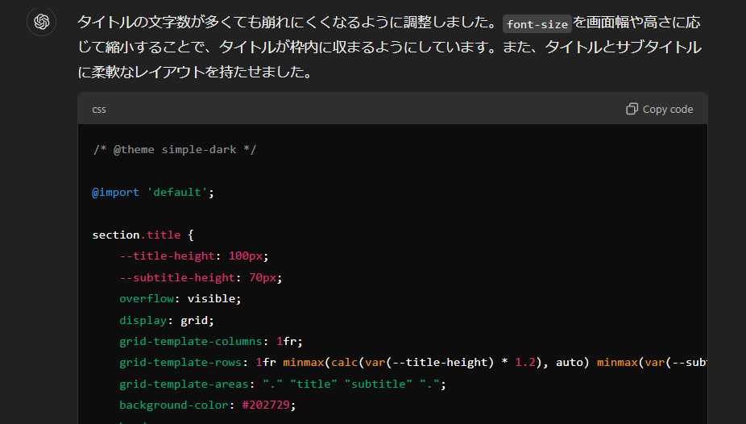

<!-- _class: title -->

# Marpを初めて触って感じた 良いところ、悪いところ

## 波紫 寛斗

---

# Marpってなに？

- aaaaaaaaaaaaaaaaaaaaaaaaaaaaaaaaaaaaaaaaaaaaaaaaaaaaa
- aaaaaaaaaaaaaaaaaaaaaaaaaaaaaaaaaaaaaaaaaaaaaa
- aaaaaa

---

<!-- _class: fit -->

# 要するに

# <!-- fit --> Markdownでスライド作れるすげーやつ

---

# 良いところ

- レイアウトがページによって若干ずれる、みたいなことがない
- 数式が使える
- スライドを Git 管理できる

---

# 悪いところ

- 独自レイアウトの調整がめんどくさい
  - タイトルの文字の大きさ
  - 画像の大きさ、表示位置
  - CSS苦手な私には少し大変だった

<!-- ここに横並びの画像 -->

---

# 【おまけ】レイアウトをどうやって作ったか

- ChatGPTさんにめちゃくちゃ頼みました
  - 雑な prompt でも良い感じに生成してくれて助かりました

