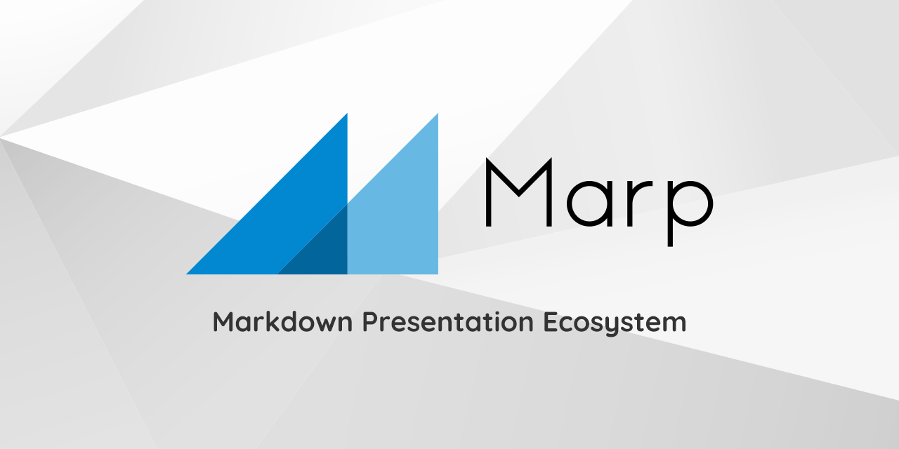

<!-- _class: title -->

# Marpを初めて触って感じた 良いところ、悪いところ

## 波紫 寛斗

---

# Marpってなに？

- Markdownを使ったプレゼンテーションのエコシステム
- CSS や SCSS でデザインを適用できる
- HTML, PDF, PowerPoint などの各種形式でエクスポートすることができる
- OSSである。ライセンスは MIT
- [ここ](https://github.com/marp-team) にコードは公開されている

---

<!-- _class: fit -->

# 要するに

# <!-- fit --> Markdownでスライド作れるすげーやつ

---

# 良いところ

- Markdown で書ける
  - （大半のエンジニアはMarkdown好きだと思ってる。え？そうでもない・・・？）
- レイアウトがページによって若干ずれる、みたいなことがない
- 数式が使える
- スライドを Git 管理できる
- QiitaやZenn で Markdown で書いた記事を、楽にスライドにすることができる

---

# 悪いところ

- レイアウトの調整がめんどくさい
  - タイトルの文字の大きさ
  - 画像の大きさ、表示位置
  - CSS苦手な私には少し大変だった
- 画像の複雑な配置が特にめんどくさい
  - 画像編集ソフトとかで複数の画像を一枚の画像にしてデメリットをカバーできるけど、その画像編集もちょっとめんどう

---

# まとめ

- 以下のような場合に Marp を使ってスライドを作った方が良さそう
  - 数式を使う場合
  - アカデミックな場面
  - QiitaやZennなどの技術ブログの記事をスライドにしたい場合
- 逆に以下のような場合では、Marp よりも Google スライドとかの方が良さそう
  - 画像や動画多めのプレゼンをしたい場合（いらすとや沢山使う時とか）
  - ド派手なデザインでプレゼンしたい場合

---

# 【おまけ】レイアウトをどうやって作ったか

Q . CSS苦手なのにどうやってレイアウト作ったんですか？

A. ChatGPTさんにめちゃくちゃ頼みました

